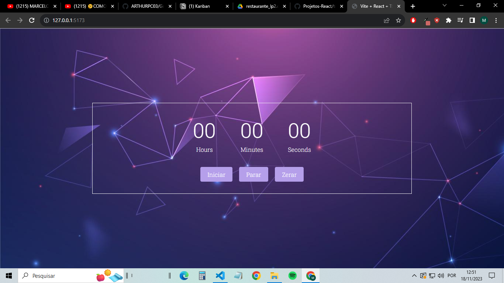

# CRONÔMETRO DIGITAL

## Sobre

<p>Cronômetro digital simples, que permite ao usuário controlar
os segundos, minutos e até horas de uma determinada atividade.</p>

## Features

- [x] Inciar cronômetro.
- [x] Pausar cronômetro.
- [x] Zerar cronômetro.



## Pré-requisitos

<p>Para rodar o projeto são necessárias as seguintes ferramentas:
[Nodejs] (https://nodejs.org/en) e [Git] (https://git-scm.com/).
Ademais, é aconselhavel ter um editor de código, como o VScode.</p>

## Como rodar
```bash
# Clone este repositório
$ git clone ""


```